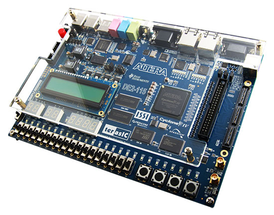

# Terasic DE2-115

This is the integration for the [Terasic DE2-115](https://www.terasic.com.tw/cgi-bin/page/archive.pl?Language=English&No=502) development board:

This is a dev board built around a [Cyclone IV](https://www.intel.com/content/www/us/en/products/details/fpga/cyclone/iv.html), specifically an EP4CE115F29C7. The dev board is the pinacle of FPGA dev boards from the late 2010s. It has everything you'd want, except perhaps HDMI (though that can be added via an addon board).

The LEDs are mapped as follows:

* LEDR0: Attached to the processor
* LEDR1: Bus error
* LEDR2: Halt

LEDG5 down to LEDG0 are mapped onto the processor to show state, though this is not very useful really.

The board sports an I2C EEPROM, but as it is only 32 Kbit it can only hold 4 bounderdash levels. There is also no buzzer, which is somewhat annoying. The extertnal memories (beside the I2C EEPFROM) are not used.

Building can be accomplished either by loading the project files into Quartus (I'm using 23.1, but the project may load into older Quartus) and building the it there, or using the provided Makefile. Note that 23.1 is unfortunately the last Quartus to support the Cyclone IV.
